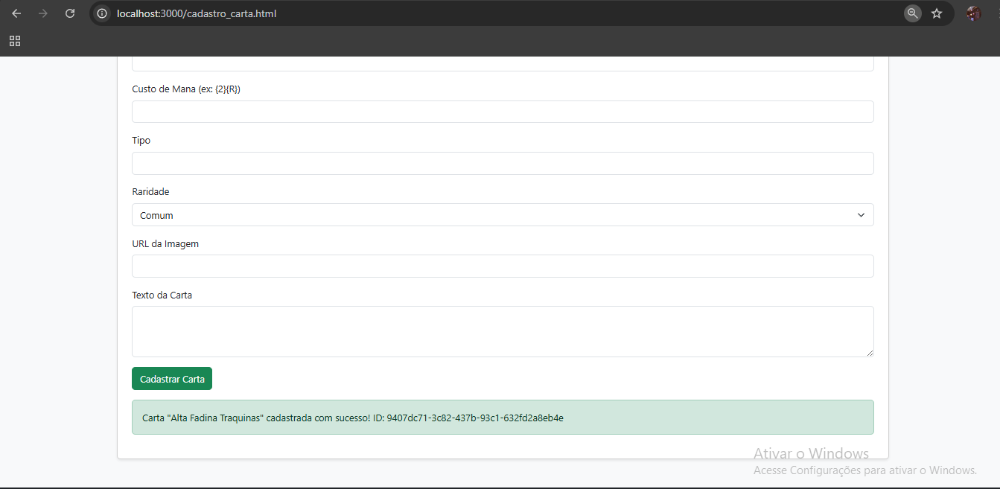
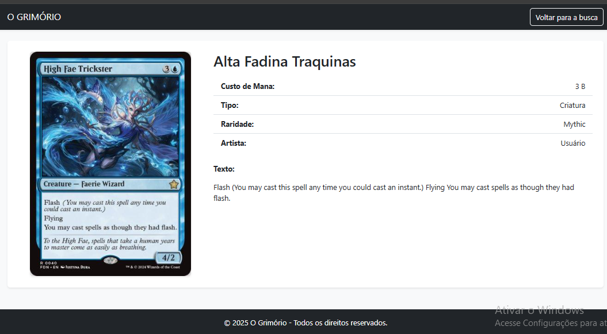
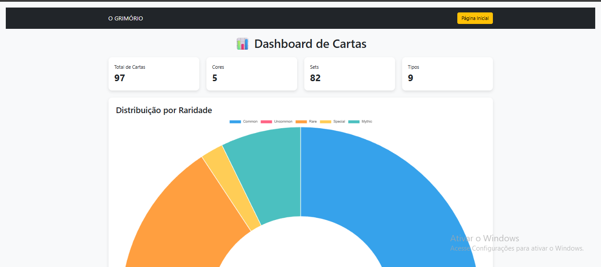

# Trabalho Prático 07 - Semanas 13 e 14

A partir dos dados cadastrados na etapa anterior, vamos trabalhar formas de apresentação que representem de forma clara e interativa as informações do seu projeto. Você poderá usar gráficos (barra, linha, pizza), mapas, calendários ou outras formas de visualização. Seu desafio é entregar uma página Web que organize, processe e exiba os dados de forma compreensível e esteticamente agradável.

Com base nos tipos de projetos escohidos, você deve propor **visualizações que estimulem a interpretação, agrupamento e exibição criativa dos dados**, trabalhando tanto a lógica quanto o design da aplicação.

Sugerimos o uso das seguintes ferramentas acessíveis: [FullCalendar](https://fullcalendar.io/), [Chart.js](https://www.chartjs.org/), [Mapbox](https://docs.mapbox.com/api/), para citar algumas.

## Informações do trabalho

- Nome: Vinicius do Amaral Fonseca Filho
- Matricula: 789221
- Proposta de projeto escolhida: (4) -  Coleções e Itens
- Breve descrição sobre seu projeto: Meu projeto é uma visualizador de cartas de Magic The Gathering. Você adicona os filtros e ele mostra até 100 cartas naquele requisito. A API usada futuramento seria essa docs.magicthegathering.io

**Print da tela com a implementação**

Nesta etapa foi criada uma página dedicada ao dashboard de gráficos, utilizando o Chart.js para gerar visualizações intuitivas e modernas.

